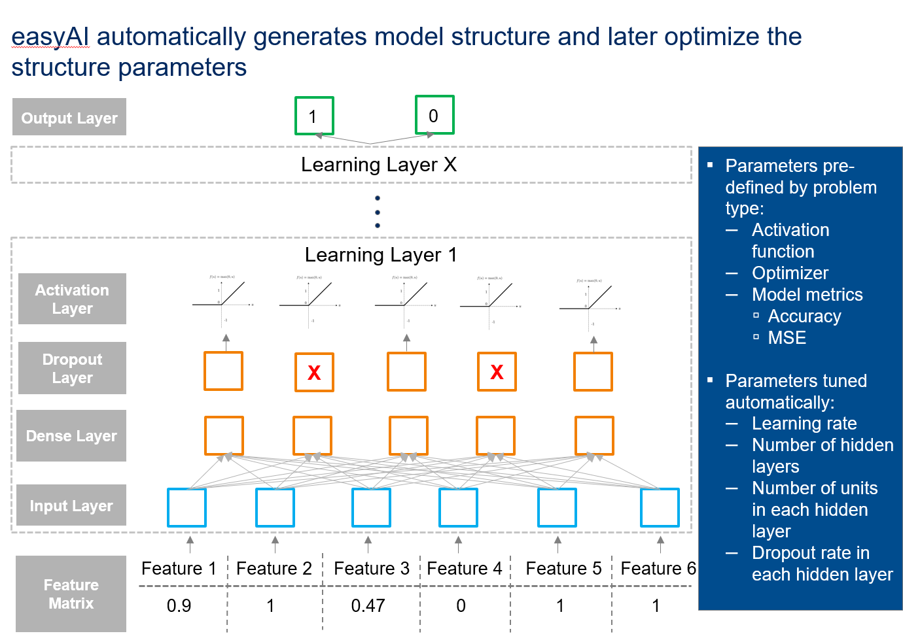

# Introduction

easyAI aims to help data scientists apply Deep Learning models to traditional machine learning problems (e.g. non image/speech, tabular data). The primary benefits are:
* Easy to use. Some neural network model attributes are pre-configured to the best knowledge of the author to tackle the specific use case
* Automated neural network structure and parameter tuning. The learning functions will test various model configurations and select the best model based on performance

# Installation
```R
devtools::install_github('tianwei-zhang/easyAI')
```
Auth_token can be generated from your enterprise GitHub setting menu. Click on your avatar/picture, and then setting. Go to Personal access tokens and generate new token.

# Usage

## Classification
```R
library(easyAI)
output=deep_logistic(x_train,y_train,option='local')
```

## Regression

```R
output=deep_lm(x_train,y_train,option='local')
```
### Hyper-parameter tuning with Google cloud
```R
output=deep_lm(x_train,y_train,option='google')
google_collect(model_id='your_model_id',project_name='project_name')
```


## Recommender Systems

### Neural Collaborative Filtering
```R
output=deep_ncf(data = data,max_units = 16,start_unit = 2)
```

### Collaborative Deep learning
TBD

# Details
## Technical Explanation
### Overview
For deep_lm and deep_logistic, the idea is to programmatically construct multiple fully connected layers (i.e. dense layers) with predefined activations, optimizer, and model metrics. At the same time, network parameters such as the number of layers are optimized to achieve the highest performance.



​                                                                    *Model Network Layout*

Here are the pre-defined parameters:

| Parameter               | deep_lm            | deep_logistic            |
| ----------------------- | ------------------ | ------------------------ |
| Output layer activation | linear             | softmax                  |
| Optimizer               | Rmsprop            | Adam                     |
| Model metrics           | mse                | Accuracy                 |
| Loss function           | Mean squared error | Categorical crossentropy |

Here are the auto-tuned parameters:

| Parameter                            | Explanation                                                  |
| ------------------------------------ | ------------------------------------------------------------ |
| Learning rate                        | The rate which we reach towards the optimal solution (e.g. too fast --> we overreach the target and oscillate around the optima; too slow --> never reach the optima within time limit) |
| Number of units in each hidden layer | Number of neurons in each hidden layer. It is a vector with the length of vector equals to the number of hidden layers. With random search, this parameter is randomly generated within the bounds (more on this latter) during each iteration. With Google Cloud hyper-parameter tuning, this parameter is optimized through the Bayesian process |
| Number of hidden layers              | Number of learning layers in the illustration above. Note that we probably don't need more than 5 layers |
| Dropout rate                         | Percentage of randomly selected neurons to be ignored in each layer. It is also a vector with the length of vector equals to the number of hidden layers. It is a regularization technique such that the network will be more robust |

### Parameter Optimization

There are two options to optimize parameters, local (random search) or google cloud. It can be set with the option parameter:

```R
deep_lm(x,y,option='local')
```

or

```R
deep_lm(x,y,option='google')
```

#### Local optimization

Local optimization deploys random search to tune parameters. It is similar to a Monte Carlo simulation, where random combinations of parameters are generated and evaluated. The combination of parameters with the best model performance is selected. 


Here are the list of parameters you can use to control this process:

| Parameter           | Type   | Explanation                                                  |
| ------------------- | ------ | ------------------------------------------------------------ |
| num_layer           | vector | it tells the functions how many hidden layers to include in the network. If the input is c(2,3), the function will try networks with 2 hidden layers and networks with 3 hidden layers |
| max_units           | int    | Optional. It indicates the maximum allowed units in a hidden layer. If you leave this input blank, it will be computed as $$\dfrac{Number_{samples}}{2*(Number_{features}+Number_{classes})}$$ |
| start_unit          | int    | The minimum number of hidden units in a layer                |
| max_dropout         | double | A numeric between 0 (inclusive) and 1 (exclusive) that indicates the maximum fraction of random neurons to be dropped |
| min_dropout         | double | A numeric between 0 (inclusive) and 1 (exclusive) that indicates the minimum fraction of random neurons to be dropped. It must be smaller or equal to max_dropout |
| max_lr              | double | maximum learning rate in a run. Default to 0.2               |
| min_lr              | double | minimum learning rate in a run. Default to 0.001. Must be greater than 0 and smaller or equal to max_lr |
| iteration_per_layer | int    | Number of random parameter combinations to generate per layer. Remember that the random search process is like throwing darts randomly to a target. Similar to a Monte Carlo simulation, getting a good approximation requires sufficient samples/simulations. This parameter specifies how many random parameter sets to try per layer. To set this parameter, consider the range between upper and lower bounds of the parameters and available computing power |
| validation_split    | double | Percent of data used for validation. Default to 20 percent   |
| num_epoch           | int    | number of epochs to go through during training. Higher value requires more computing power |
| num_patience        | int    | number of epochs to wait before early stop if no progress on the validation set |


####Google Cloud Hyper-parameter Tuning

Random search is a naïve process which is limited by computing power. Without sufficient samples, we cannot confidently say that the output is close to optimum. Google Cloud solves this problem by apply Bayesian optimization to our deep learning model parameters. 


You can read more about the Bayesian optimization [here](https://cloud.google.com/blog/big-data/2017/08/hyperparameter-tuning-in-cloud-machine-learning-engine-using-bayesian-optimization).

In order to use Google Cloud, you first need to set up Google Cloud SDK on your location machine. Here are the steps:

1. Register on Google Cloud https://cloud.google.com/

2. Create a project in the Google Cloud console 

3. Install cloudml R library ```devtools::install_github("rstudio/cloudml")```

4. Install Google Cloud SDK

   ```
   library(cloudml)
   gcloud_install()
   ```

   Due to issues with white spaces in directory, I recommend to install for all users ('under /Program Files (x86)'). Also do not choose a custom directory. The cloudml package is only looking for the binaries in a number of fixed directories. 

5. Initialize Google Cloud SDK ```gcloud_init()``` . Follow the prompts in command line interface

Now, in order to tune parameters on Google Cloud, you only need to supply one additional parameters: machine_type. See the available options below:

| Cloud ML Engine machine type |                                                              |
| ---------------------------- | ------------------------------------------------------------ |
| `standard`                   | A basic machine configuration suitable for training simple models with small to moderate datasets.**Compute Engine machine type:** n1-standard-4 |
| `large_model`                | A machine with a lot of memory, specially suited for parameter servers when your model is large (having many hidden layers or layers with very large numbers of nodes).**Compute Engine machine type:** n1-highmem-8 |
| `complex_model_s`            | A machine suitable for the master and workers of the cluster when your model requires more computation than the standard machine can handle satisfactorily.**Compute Engine machine type:** n1-highcpu-8 |
| `complex_model_m`            | A machine with roughly twice the number of cores and roughly double the memory of complex_model_s.**Compute Engine machine type:** n1-highcpu-16 |
| `complex_model_l`            | A machine with roughly twice the number of cores and roughly double the memory of complex_model_m.**Compute Engine machine type:** n1-highcpu-32 |
| `standard_gpu`               | A machine equivalent to standard that also includes a single NVIDIA Tesla K80 GPU.**Compute Engine machine type:** n1-standard-8 with one k80 GPU |
| `complex_model_m_gpu`        | A machine equivalent to complex_model_m that also includes four NVIDIA Tesla K80 GPUs.**Compute Engine machine type:** n1-standard-16-k80x4 |
| `complex_model_l_gpu`        | A machine equivalent to complex_model_l that also includes eight NVIDIA Tesla K80 GPUs.**Compute Engine machine type:** n1-standard-32-k80x8 |
| `standard_p100`              | A machine equivalent to standard that also includes a single NVIDIA Tesla P100 GPU. The availability of these GPUs is in *Beta* launch stage.**Compute Engine machine type:** n1-standard-8-p100x1 |
| `complex_model_m_p100`       | A machine equivalent to complex_model_m that also includes four NVIDIA Tesla P100 GPUs. The availability of these GPUs is in *Beta* launch stage.**Compute Engine machine type:** n1-standard-16-p100x4 |

## Why did I make this package?

When I started learning deep learning, I encountered three challenges:

- A lot of jargons in the field. Even to get started, beginners are hit with terms like learning rate, optimizer, dense network, and etc. It feels overwhelming
- Need to learn a different syntax to code models in R. Although it is much easier now with keras than tensorflow to build deep learning models in R, it is still quite different than what data scientists are used to (e.g. rpart(data), glm(data))
- Uncertain about model structure. With keras or tensorflow, you can construct the model anyway you want. However, is the model structure optimal to solve the problem? An experienced deep learning data scientist can rely on their experience to guess the appropriate structure. For beginner, it is a challenge

So how does the easyAI package solvethese challenges?

1. The easiest form of the learning functions is extremely simple. In its minimalistic form, the user only needs to provide a feature matrix and target columns to build deep learning models. Users can also tweak the default setup through additional parameters in the learning function.
2. Model structure (e.g. number of layers, learning rate) is automatically optimized to achieve the best performance. Users can choose either local or google cloud to tune the hyer-parameters such as learning rate and number of units in hidden layers. Users can be more confident about the final model and its performance (in case of comparison)